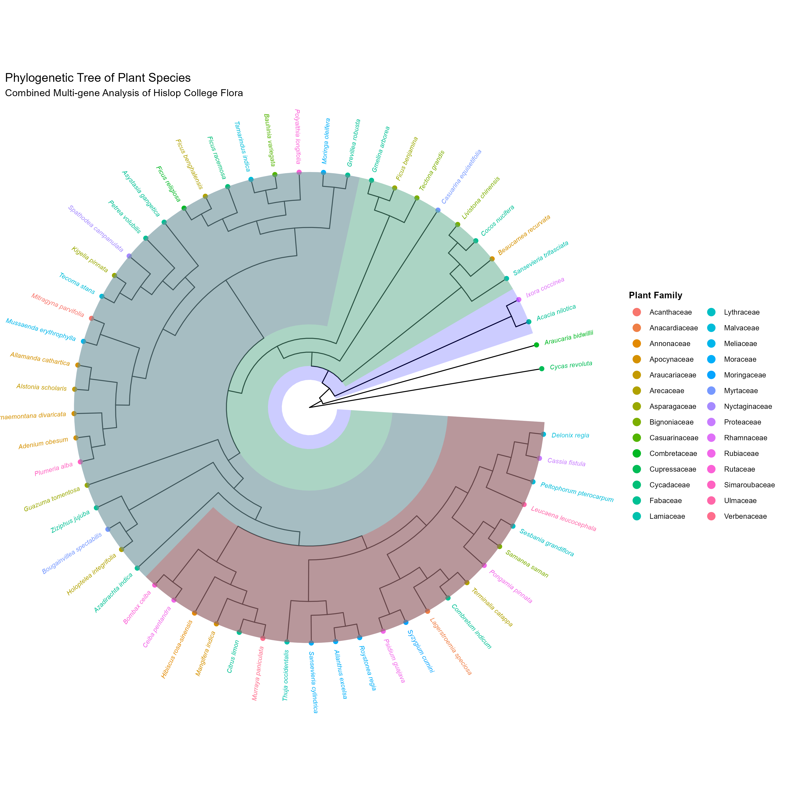

# Molecular Phylogenetic Analysis and Species Database of Campus Flora at Hislop College, Nagpur

<p align="center">
  
</p>

<p align="center">
  <a href="https://www.r-project.org/">
    
  </a>
  <a href="https://www.mysql.com/">
    
  </a>
  <a href="https://bioconductor.org/packages/ggtree">
    
  </a>
  <a href="LICENSE">
    
  </a>
  <a href="#">
    
  </a>
  <a href="#">
    
  </a>
</p>

---

## Overview

This repository presents the computational framework, datasets, and results for a Master's-level research project integrating **molecular phylogenetics**, **biodiversity informatics**, and **relational database management** for the documentation and evolutionary analysis of campus plant diversity.

A multi-gene molecular phylogenetic framework was developed for **59 plant species** occurring on the Hislop College campus, Nagpur, Maharashtra, India. Evolutionary relationships were inferred using Maximum Likelihood methods, and a circular phylogenetic tree was generated with family-level color coding. Complementing the phylogenetic analysis, a structured **MySQL relational database** was designed to organize, store, and query taxonomic and biodiversity information associated with the documented flora.

This project demonstrates a reproducible, end-to-end bioinformatics workflow from field survey and molecular data curation to phylogenetic reconstruction, visualization, and biodiversity database development, applicable to urban ecosystem biodiversity assessment and conservation informatics.

---

## Scientific Background

Urban campus environments serve as valuable model systems for studying plant biodiversity, taxonomy, and evolutionary relationships within anthropogenic ecosystems. Hislop College, Nagpur, Maharashtra hosts a heterogeneous assemblage of ornamental, medicinal, native, and cultivated plant species, making it an ecologically and taxonomically rich study site.

Molecular phylogenetics, using multi-gene sequence datasets retrieved from public repositories, enables rigorous inference of evolutionary relationships beyond morphology-based classification. Integration of phylogenetic data with relational database architectures facilitates scalable, queryable biodiversity documentation, a foundational requirement for conservation planning, ecological monitoring, and comparative biodiversity research.

This project bridges field botany, molecular evolutionary biology, and computational data management within a unified, reproducible bioinformatics framework.

---

## Research Objectives

- Document and organize the plant biodiversity of the Hislop College campus, Nagpur.
- Curate a high-quality multi-gene molecular sequence dataset for phylogenetic analysis.
- Reconstruct evolutionary relationships among 59 campus plant species using Maximum Likelihood phylogenetics.
- Identify and visualize major phylogenetic clades and family-level groupings.
- Generate publication-quality circular phylogenetic tree figures with family-level annotation.
- Design and implement a relational MySQL database for structured biodiversity data management.
- Establish a reproducible bioinformatics workflow for future comparative campus biodiversity studies.

---

## Study Area

| Attribute | Details |
|-----------|---------|
| **Institution** | Hislop College, Nagpur |
| **Location** | Nagpur, Maharashtra, India |
| **Ecosystem Type** | Urban campus ecosystem |
| **Vegetation Composition** | Ornamental, medicinal, native, and cultivated plant species |
| **Biodiversity Significance** | Diverse multi-family plant assemblage within an urban landscape |

The campus flora represents a taxonomically diverse assemblage spanning multiple angiosperm families and growth forms, providing a suitable model system for integrating molecular phylogenetics with urban biodiversity assessment.

---

## Dataset Description

### Summary

| Feature | Details |
|---------|---------|
| **Total Species** | 59 |
| **Kingdom** | Plantae |
| **Outgroup Species** | *Cycas revoluta* (Cycadaceae) |
| **Data Type** | Multi-gene molecular sequences |
| **Sequence Source** | Public sequence repositories (curated) |
| **Tree Format** | Newick (`.nwk`) |
| **Taxonomic Coverage** | Multiple families and genera |

### Metadata Variables

| Variable | Description |
|----------|-------------|
| Botanical Name | Accepted scientific binomial |
| Family | Plant family classification |
| Genus | Genus-level classification |
| Species Epithet | Species-level identifier |
| Taxonomic Rank | Hierarchical classification |
| Phylogenetic Placement | Clade assignment from ML tree |

---

## Methodology

### 1. Plant Survey and Taxonomic Identification

A systematic field survey was conducted across the Hislop College campus to document all identifiable plant species. Taxonomic identification was verified using standard botanical references and herbarium resources. Species selection prioritized broad family-level representation.

### 2. Molecular Data Collection

Multi-gene molecular marker sequences were retrieved from public biological sequence repositories. Data were curated to ensure sequence quality, taxonomic accuracy, and consistency across all 59 target species and the outgroup taxon, *Cycas revoluta*.

### 3. Multiple Sequence Alignment

Retrieved sequences were subjected to multiple sequence alignment to identify and verify homologous nucleotide positions across all taxa. Alignment quality was assessed prior to phylogenetic analysis.

### 4. Phylogenetic Reconstruction

Evolutionary relationships were inferred using **Maximum Likelihood (ML)** phylogenetic methods applied to the multi-gene aligned dataset. The ML framework was selected for its statistical robustness and suitability for multi-gene molecular datasets.

### 5. Tree Rooting

The resulting phylogenetic tree was rooted using *Cycas revoluta* (Cycadaceae) as the designated outgroup, establishing correct evolutionary polarity and directionality across all ingroup lineages.

### 6. Phylogenetic Visualization

Tree visualization, annotation, and figure generation were performed in R using:

| Package | Role |
|---------|------|
| `ggtree` | Phylogenetic tree plotting and annotation |
| `ape` | Tree manipulation and Newick import |
| `phytools` | Tree utilities and evolutionary analysis |
| `ggplot2` | Graphical aesthetic customization |
| `dplyr` | Metadata handling and data wrangling |

A **circular phylogenetic tree** was generated with family-level color coding to facilitate visualization of major phylogenetic groupings and biodiversity patterns.

### 7. Species Database Development

A normalized **MySQL relational database** was designed and implemented to store, manage, and query all taxonomic and biodiversity information associated with documented campus flora. The schema supports extensible biodiversity data management for future studies.

---

## Computational Methods and Software

| Category | Tool / Software |
|----------|----------------|
| **Phylogenetic Analysis** | Maximum Likelihood (ML) |
| **Programming Language** | R (>= 4.5) |
| **Tree Visualization** | ggtree (Bioconductor) |
| **Evolutionary Utilities** | ape, phytools |
| **Data Manipulation** | dplyr, ggplot2 |
| **Database Management** | MySQL, SQL |
| **Version Control** | Git, GitHub |

---

## Repository Structure

```text
PhylogenyFlora/
│
├── data/
│   ├── final_59_plant_tree.nwk     # Maximum Likelihood phylogenetic tree (Newick format)
│   └── plantdb.sql                 # MySQL species database schema and records
│
├── scripts/
│   └── main_analysis.R             # Complete phylogenetic analysis and visualization workflow
│
├── figures/
│   └── final_colorful_tree.png     # Publication-quality circular phylogenetic tree
│
├── README.md
├── LICENSE
└── .gitignore
```

---

## Installation

### Prerequisites

Ensure the following are installed on your system:

- **R** (>= 4.5): [https://cran.r-project.org](https://cran.r-project.org)
- **MySQL** (>= 8.0): [https://dev.mysql.com](https://dev.mysql.com)
- **Git**: [https://git-scm.com](https://git-scm.com)

### Clone Repository

```bash
git clone https://github.com/YOUR_USERNAME/PhylogenyFlora.git
cd PhylogenyFlora
```

### Install R Dependencies

```r
# Install CRAN packages
install.packages(c("ape", "phytools", "ggplot2", "dplyr"))

# Install Bioconductor packages
if (!requireNamespace("BiocManager", quietly = TRUE))
  install.packages("BiocManager")

BiocManager::install("ggtree")
```

---

## Usage

### Phylogenetic Analysis and Visualization

Run the complete analysis workflow in R:

```r
source("scripts/main_analysis.R")
```

**Outputs generated:**

- Circular phylogenetic tree with family-level color coding (`figures/final_colorful_tree.png`)
- Family-level clade visualization
- Publication-quality PNG figures suitable for thesis, poster, or manuscript submission

### Database Setup

Import the MySQL species database:

```bash
mysql -u root -p
```

```sql
SOURCE data/plantdb.sql;
```

Once imported, the database supports queries for species records, taxonomic hierarchies, family-level summaries, and phylogenetic metadata.

**Example query:**

```sql
-- Retrieve all species organized by family
SELECT family, genus, species, taxonomic_rank
FROM species_catalog
ORDER BY family, genus;
```

---

## Results and Key Findings

| Outcome | Description |
|---------|-------------|
| **Phylogenetic Reconstruction** | ML tree successfully resolved evolutionary relationships among all 59 campus plant species |
| **Family-Level Clades** | Major angiosperm family groupings identified and color-annotated on the circular tree |
| **Outgroup Rooting** | *Cycas revoluta* correctly resolved as sister to all ingroup taxa, confirming tree directionality |
| **Tree Visualization** | Publication-quality circular phylogenetic tree generated with family-level color coding |
| **Biodiversity Database** | Normalized MySQL database developed with species, taxonomic, and phylogenetic data tables |
| **Reproducible Workflow** | End-to-end bioinformatics pipeline documented and version-controlled |

The phylogenetic analysis revealed that campus plant diversity spans multiple major angiosperm lineages, with clear family-level clustering consistent with established molecular systematics. The resulting tree and associated database together constitute a structured biodiversity resource for the Hislop College campus ecosystem.

---

## Database Component

### MySQL Species Database

The `plantdb.sql` schema implements a normalized relational database for campus flora biodiversity management.

#### Database Tables

| Table | Contents |
|-------|----------|
| `species_catalog` | Core species records: botanical name, family, genus, species epithet |
| `taxonomic_hierarchy` | Full taxonomic classification per species |
| `phylogenetic_metadata` | Phylogenetic placement and clade assignments |
| `biodiversity_records` | Campus occurrence and survey records |

#### Features

- Structured taxonomic hierarchy storage
- Family and genus relational linking
- Phylogenetic placement metadata integration
- Extensible schema for future ecological and distributional data
- SQL-queryable for research data retrieval and reporting

#### Database Import

```bash
mysql -u root -p < data/plantdb.sql
```

---

## Scientific Significance

This project contributes to biodiversity science and computational biology in several respects:

- **Biodiversity Documentation:** Provides the first molecularly anchored phylogenetic survey of plant species on the Hislop College campus, establishing a baseline for long-term biodiversity monitoring.
- **Evolutionary Framework:** The ML phylogenetic tree places campus flora within a rigorous evolutionary context, enabling comparative analyses with regional and national plant diversity datasets.
- **Database Infrastructure:** The MySQL species database provides a structured, queryable resource for taxonomic and biodiversity data management, directly applicable to conservation planning and ecological research.
- **Methodological Integration:** Demonstrates the integration of field survey, molecular phylogenetics, and relational database design within a single reproducible bioinformatics workflow, a model applicable to campus biodiversity studies at other institutions.
- **Training in Reproducible Science:** The project exemplifies best practices in computational biology, including version control, documented workflows, and open data principles.

---

## Reproducibility

This project adheres to reproducibility standards consistent with open computational biology research:

| Component | Status |
|-----------|--------|
| Source code | Publicly available (`scripts/main_analysis.R`) |
| Phylogenetic tree data | Included (`data/final_59_plant_tree.nwk`) |
| Species database schema | Included (`data/plantdb.sql`) |
| Software versions | Documented in this README |
| Analysis workflow | Fully documented and executable |
| Version control | Maintained via Git and GitHub |

All analyses can be reproduced by cloning this repository, installing the documented R dependencies, and executing `main_analysis.R`.

---

## Future Directions

Planned and proposed extensions of this work include:

- **DNA Barcoding:** Validation of species identifications using standardized barcode loci (*rbcL*, *matK*, ITS)
- **Chloroplast Genome Phylogenetics:** Whole-plastome phylogenomic analysis for improved resolution
- **Phylogenetic Diversity Metrics:** Computation of Faith's PD and related indices for biodiversity assessment
- **Species Richness Estimation:** Application of rarefaction and diversity estimation methods
- **Comparative Campus Biodiversity Studies:** Cross-institutional phylogenetic diversity comparisons
- **Interactive Phylogenetic Tree Dashboard:** Web-based interactive tree visualization (e.g., iTOL integration or custom Shiny application)
- **GIS-Based Biodiversity Mapping:** Spatial mapping of species distributions across the campus
- **Web-Based Biodiversity Portal:** Public-facing database interface for species records and phylogenetic data
- **Automated Species Information Retrieval:** Integration with GBIF, NCBI, and Plants of the World Online APIs

---

## Citation

If you use this repository, dataset, or analytical workflow in academic work, please cite:

```
Samrudhi Sharma (2026). Molecular Phylogenetic Analysis and Species Database of
Campus Flora at Hislop College, Nagpur. M.Sc. Bioinformatics Project.
Rajiv Gandhi Institute of IT and Biotechnology, Pune, Maharashtra, India.
GitHub: https://github.com/YOUR_USERNAME/PhylogenyFlora
```

---

## Author

**Samrudhi Sharma**

M.Sc. Bioinformatics
Rajiv Gandhi Institute of IT and Biotechnology, Pune, Maharashtra, India

---

## License

This project is released under the **MIT License**.

See the [LICENSE](LICENSE) file for complete terms.

---

<p align="center">
  <i>Developed as part of an M.Sc. Bioinformatics research project · Hislop College Campus Flora, Nagpur, India</i>
</p>
